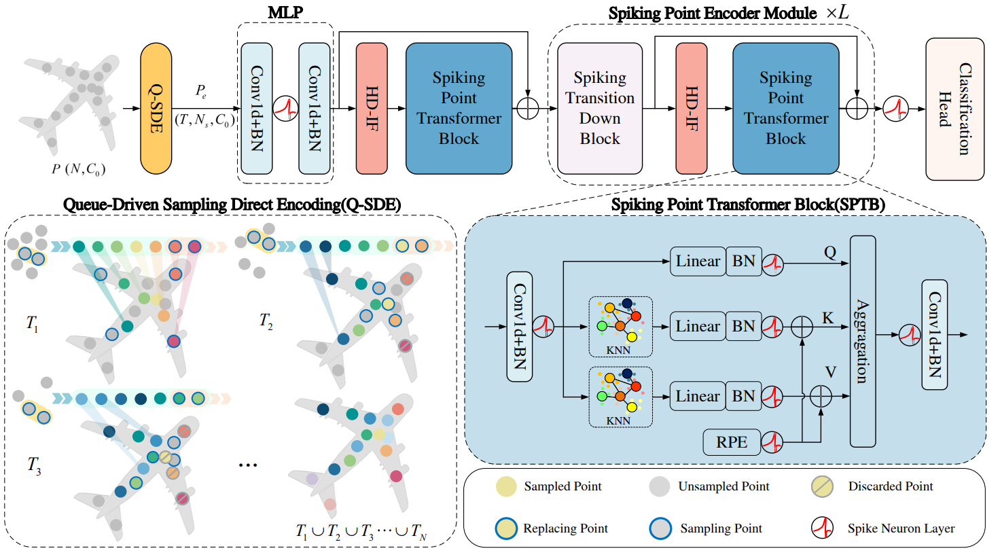

# Spiking Point Transformer (AAAI 2025)



🚀 This is the official PyTorch implementation of the AAAI 2025 paper:  
**[Spiking Point Transformer for Point Cloud Classification](https://arxiv.org/pdf/2502.15811)**

## Data Preparation
Ensure your directory structure follows:

```
│Spiking_Point_Transformer/
├── config/
├── data/
│   ├── modelnet40_normal_resampled/
│   ├── ScanObjectNN/
├── .......
```

**ModelNet40 Dataset:**  
Download the aligned ModelNet dataset from [here](https://shapenet.cs.stanford.edu/media/modelnet40_normal_resampled.zip) and extract it to `data/modelnet40_normal_resampled/`.

**ScanObjectNN Dataset:**  
Download the official data from [here](http://103.24.77.34/scanobjectnn) and extract it into `data/ScanObjectNN/`.

## Installation
Tested on **Ubuntu 20.04**, **CUDA 11.7**, **PyTorch 1.13.1**, **Python 3.9**.

### Create Environment
```sh
conda create -y -n spt python=3.9
conda activate spt
conda install pytorch==1.13.1 torchvision==0.14.1 pytorch-cuda=11.7 -c pytorch -c nvidia
```

### Install Dependencies
```sh
pip install -r requirements.txt
cd ops/fps/ && python setup.py install
```

## Usage

Modify the method in `config/cls.yaml` and `config/model/Hengshuang.yaml`, then run:
```sh
python train_cls.py
```

## Citation
If you find this work useful, please consider citing:
```bibtex
@article{wu2025spiking,
  title={Spiking Point Transformer for Point Cloud Classification},
  author={Wu, Peixi and Chai, Bosong and Li, Hebei and Zheng, Menghua and Peng, Yansong and Wang, Zeyu and Nie, Xuan and Zhang, Yueyi and Sun, Xiaoyan},
  journal={arXiv preprint arXiv:2502.15811},
  year={2025}
}
```

## Acknowledgements

The project is largely based on [Point-Transformer](https://github.com/qq456cvb/Point-Transformers) and has incorporated numerous code snippets from [Spike-Driven-Transformer](https://github.com/BICLab/Spike-Driven-Transformer), SpikingJelly from [SpikingJelly](https://github.com/fangwei123456/spikingjelly). Many thanks to these three projects for their excellent contributions!

Feel free to contribute and reach out if you have any questions!


